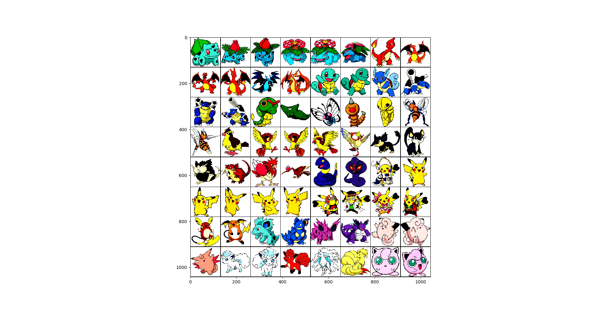
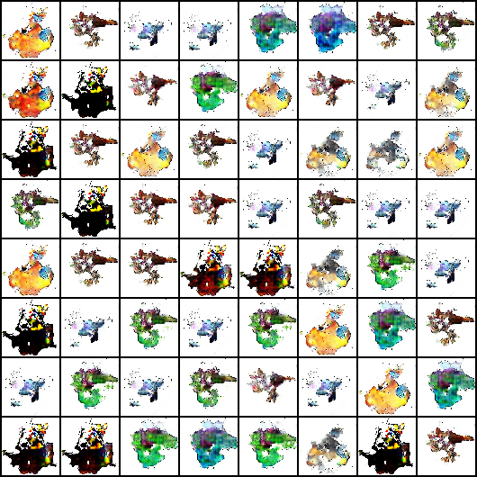
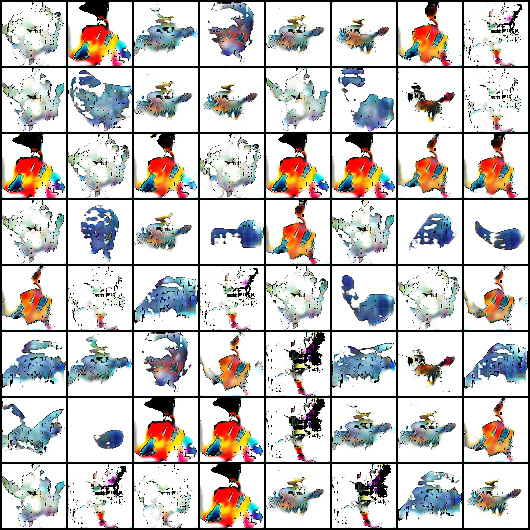

# Pokemon-GAN

A pratice project for me that aims to:

- Learn basic knowledge of deep learning
- Learn GAN and know more about deep generative model
- Learn pytorch

## Project goal

GAN now is a popular model in deep generative model area, and it has been proved that GAN can generate anime face using appropriate GAN structure. 

Since Pokemon is a famous anime all over the world and it attracts children's attention due to its cute face, we may wonder whether GAN can actually help the designer to generate Pokemon that are also cute and lovely

The goal of the project itself is to generate new pokemon using GAN, to better understanding how the GAN can actually learn and generate, instead of learning to generate anime face, we would like to explore whether the GAN can capture the features on pokemon and generate the pokemon, the fictional creatures in pokemon series.

## Dataset

We use the following 3 datasets to test the performance of different GANs

### Pokemon dataset

This is the main dataset we try to train the GAN since we hope that new pokemon can be generate through the model. The dataset contains about 23000 pictures that are collected from the internet, since the kinds of the pokemon is only 800+, we then collect the pictures from the 3 different artists:

- Ken
- Dream work
- Anime official

Also, we do image augmentations for the images mentioned above to expand our dataset, we use the following augmentation: flip vertically, rotation with 15 degree clockwise and counterclockwise, change the satuation, change the brightness, total 5 kinds of augmentation

The image size we are going to test are: 64 * 64, 128 * 128

This is the pictures we collected and have made satuation augmentation:

### Cifar 10

This dataset can be obtain by pytorch

### anime face dataset

The dowmload site is [here](https://github.com/jayleicn/animeGAN). Thanks @jayleicn to clean the raw data and put it on the cloud.

## architeture of GANs

- DCGAN(DCGAN family): mostly used in generating pokemon, and also we use this model as our benchmark compared to other two GAN network
- illustrationGAN(MLP + DCGAN): a famous GAN structure that used to generate anime face, project link is [illustrationGAN](https://github.com/tdrussell/IllustrationGAN), we aim to implement this GAN structure in PyTorch
- animeGAN(ResNet family): a GAN that used to generate high resolution anime gan, we found it in this [Towards the Automatic Anime Characters Creation with Generative Adversarial Networks](https://arxiv.org/pdf/1708.05509.pdf), this GAN use the basic structure from SRResNet and then use ACGAN and DRAGAN techniques to stablized the training procedure.

## Reuslt

For the result, we use 64X64 pixels images for training the DCGAN and illustrationGAN, and use 128X128 pixels images to traing the high resolution anime GAN and obtain the current result:

For illustrationGAN, we found that for Pokemon dataset, it has better peoformance to normalize the image with channel wise mean and channel wise standard deviation for each channel

For the above images, we can show that the GAN can learn the shape and the basic color for the Pokemon, but can not make details in the small images. Also, there may occurs the mode collapse phenomenon.